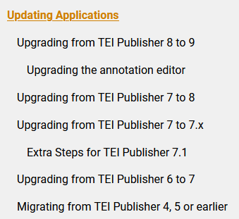

# Parzivals ODD‑Âventiuren

Die Suche nach dem ewig wartbaren Gral

<style>
  .slide { background: url(dsl0.png) center; background-size: cover }
#  .content { filter: invert() }
  code { opacity: 0.8 }
</style>

---

## Parzival-Legacy

[](https://parzival.unibe.ch/parzdb/index.php)

<style>
    .slide img {
        max-height: 500px;        
    }
</style>
---
### Legacy Workflow

Tustep
`$<*T 103.06>_<vara1>der</var> küniginne über driu lant,`
--> TXT<br />
`21;r;a;103;6;;d(er) kvneginne vber driv lant`
--> SQL-DB --> php --> HTML
`<td><span class="versheader">103.<a name="103.6">6</a></span> <span class="vers-content">d<span class="7">(er)</span> kvneginne vber driv lant</span></td>`

---

## Pilotanwendung TEIPublisher

erste Idee: klassischer TEIPublisher-Stack

Anspruch: Funktionserhalt, UI/UX-Entscheidungen beibehalten

---


---


---

[](https://dhbern.github.io/presentation_parzival/textzeugen/d-mk/719/25)

---

### roadblocks

---

#### Revisionskontrolle

---
Unser Versuch

Single source of truth: github repository.

Wenn sich Daten in github ändern: gh-action vergleicht mit TEI-Publisher und pusht via API

Wenn sich Daten in TEI-Publisher ändern: XQuery Trigger startet gh-action, die Dateien vergleicht.

---

Organisation der Seite passt nicht zu XML-Struktur
<!-- bei Fassungen -->
[Synoptische XML](https://github.com/DHBern/parzival-static-api/blob/master/dist/api/tei/original/syn2.xml) als Grundlage
``` xml
<text>
<body>
<div type="Dreissiger" subtype="d" n="2">
<div type="Textteil" subtype="d" n="2">
<head>*D</head>
```

---

Fehlende webcomponents-Expertise am DSL
[](https://cdn.tei-publisher.com/@2.23.2/dist/api.html#pb-document.0)

---

### neues Konzept

TEIPublisher nur für rendering der text views / Transkriptionen

```
fetch(
`${teipb}/parts/${element.handle}.xml/json
?odd=parzival.odd
&view=single
&xpath=//text/body/l[@xml:id=%27${element.handle}_${thirties}.${verse}%27]`)
```

kleingranular möglich durch [XQuery-API (rendered snippets)](https://dhbern.github.io/presentation_parzival/einzelverssynopse/103/07)

---

ODD nur CSS-Klassen
```
<elementSpec ident="seg" mode="change">
    <model behaviour="inline" cssClass="glory-initial">
        <param name="subtype" value="Prachtinitiale"/>
    </model>
    <model behaviour="inline" cssClass="initial" useSourceRendition="true">
        <param name="type" value="Initiale"/>
    </model>
</elementSpec>
```
Funktionalität und Design nur im Frontend

---

[statisches Backend](https://github.com/DHBern/parzival-static-api/blob/master/dist/api/json/contiguous_ranges.json)
```json
{
  "meta": {
    "generated-by": "parzival-static-api\/src\/generate.xsl",
    "task": "contiguous-ranges",
    "generated-on": "2024-09-04T16:16:13.951621295Z",
    "description": "Contiguous ranges of 'Dreissiger' for each edited document;
    this is the backbone for the overview\/linking visualisation a.k.a. 'devil's table'."
  },
  "contiguous-ranges": [
    {
      "values": [
        [ 421, 429 ],
        [ 636, 644 ]
      ],
      "label": "fr1"
    },
  ]
}
```
<style>
  code {
    line-height: 1.1 !important;    
  }
</style>
Strukturdateien und Metadaten versionskontrolliert über eigene API (skriptbasiert, GH Actions) als Grundlage für [erweiterte Features](https://dhbern.github.io/presentation_parzival/)

---

## Wo stehen wir?

---

### Wünschenswert

* **abgrenzbare Einheiten** (Modularität) mit klarem Zweck (Funktionalität)

* **Dokumentation** (*sweet spot*: alles Betriebsrelevante prominent vorhanden; alles Weitere so konzise wie möglich)

* **reduzierte Serverabhängigkeit** (statisch, was statisch geht)

* **ODD-Generierung umgebungsunabhängig**

<span style="font-size:0.5em;line-height:0.5em;">In näherer Zukunft setzen wir uns aber auch mit dem "klassischen" Betrieb auseinander (als Dienstleistungsangebot von UB/DH/DSL).</span>

---

## 🚩 Red Flags 🚩

* technisch
* organisatorisch/sozial
* konzeptuell

---

### technisch 🚩
---

backup < revision control (data & app config)

---

non-containment;
jede App braucht de facto eigenen exist-server (Fehlendes feinteiliges user-management)

<!-- Hier gibt's keinen zu zeigennden Screenshot, einfach die Situation erklären: obwohl man einen owner definieren können soll, haben wir es nicht geschafft, zwei apps so zu konfigurieren, dass auf der einen nur user des einen projekts, auf der anderen nur user des anderen projekts dokumente ändern können. -->

---

komplexes versioning

- verschiedene integrale Bestandteile, **die niemals unabhängig von TEIP genutzt werden**, sind einzeln versioniert und sind nur mit bestimmten Versionen kompatibel.
  - Exist-db 6.2.0
  - Tei Publisher 9.0.0
  - Web components 2.19.0
  - API 1.0.0

---

Upgrades sind keine simple Sache und jede major version benötigt manuelle Anpassungen (bei eXist teils auf Datenebene).

[](https://exist-db.org/exist/apps/wiki/blogs/eXist/eXistdb620)
[](https://teipublisher.com/exist/apps/tei-publisher/documentation/updating?action=search&view=div&odd=docbook.odd#3.28.15.3)

---

### organisatorisch/sozial 🚩

* wachsende Community
* kleines Kernentwicklungsteam
* Risiken
  * feature requests
  * Bus-Faktor
  * Stimmung

---

 
### konzeptuell 🚩


<!-- Irgendeine Take-Home message.
Z.B. reine TEI-Publisher-workflows machen nur Sinn, wenn sie von Jinntec umgesetzt werden.
-->
